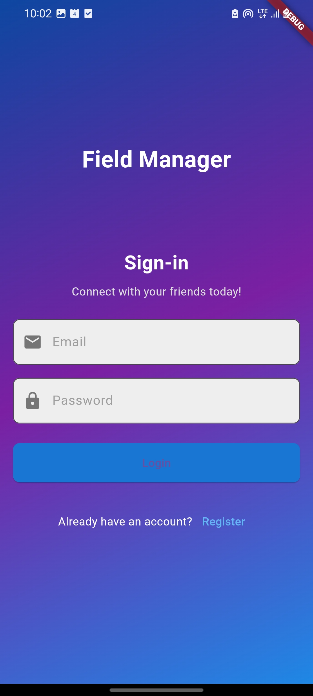
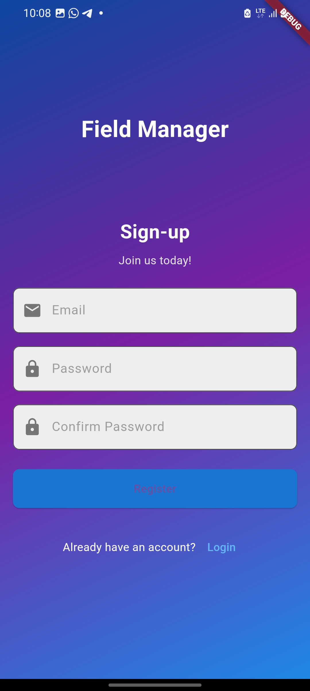
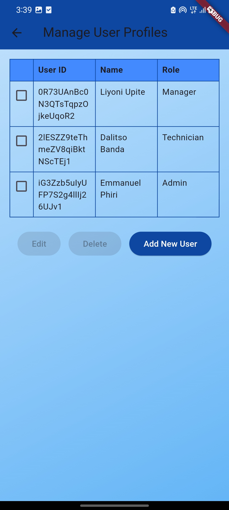
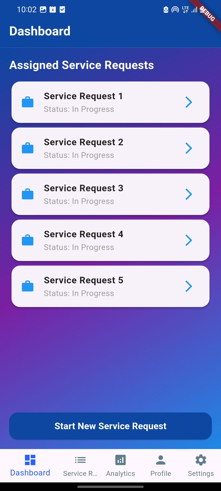
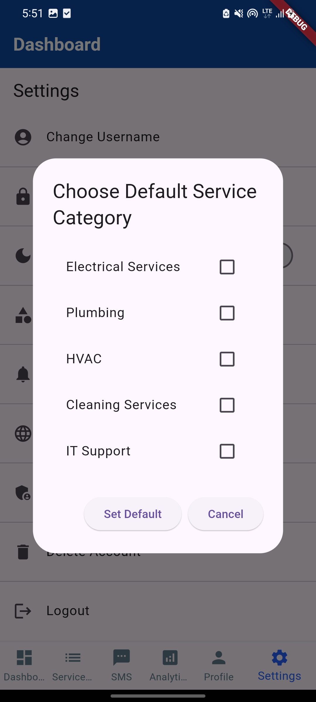
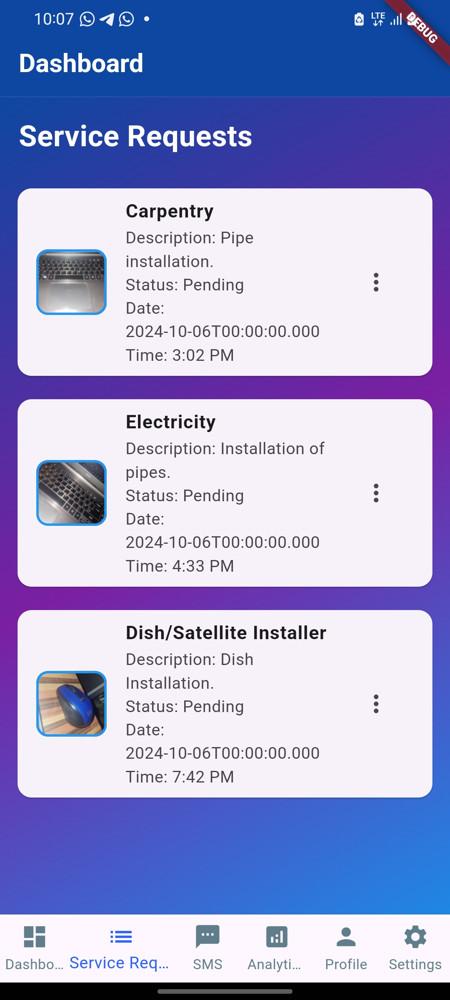
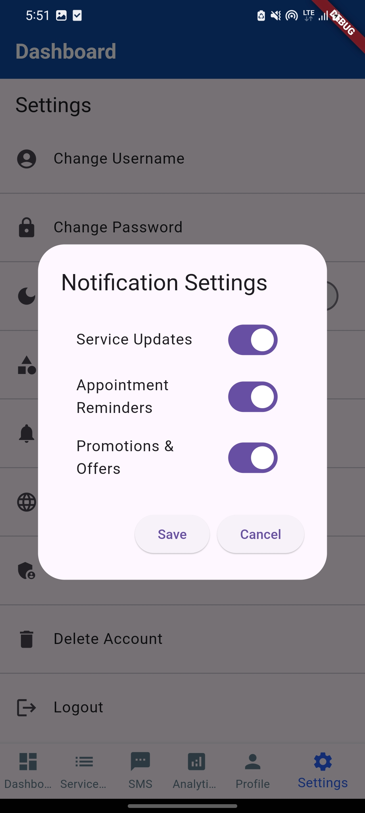

# Field Service Management App

A Flutter-based Field Service Management application designed to coordinate
field technicians, managers, and administrators through role-based access
control, service requests, technician assignment, location tracking, and
service reporting.

The system was developed as an academic software project to demonstrate
mobile application development, Firebase integration, role-based access
control, cloud database management, and location-based field service
operations.

---

## Overview

The Field Service Management App is designed for organizations that manage
technicians who provide services at different client locations.

For example, a manager may receive a request from a client who requires an
electrician, plumber, carpenter, technician, or other field-service
professional.

The manager can assign the appropriate technician to the job. The technician
receives the service request, accepts the assignment, travels to the required
location, performs the task, and submits a completion report with supporting
evidence such as a photograph.

The administrator manages the users and maintains the overall user structure
of the system.

## Application Preview

### Authentication

<p align="center">
  
  &nbsp;&nbsp;
  
</p>

### Administrator Interface

<p align="center">
  
</p>

### Manager Dashboard

<p align="center">
  
</p>

### Service Management

<p align="center">
  
  &nbsp;&nbsp;
  
</p>

### Profile and Settings

<p align="center">
  
  &nbsp;&nbsp;
  
</p>

## Core Roles

The system is designed around three primary roles:

### 1. Administrator

The administrator is responsible for managing users within the system.

Administrator capabilities include:

- Viewing registered users
- Adding users
- Editing user information
- Removing users
- Managing user roles
- Viewing user information such as User ID, name, and assigned role

The administrator does not perform or assign field-service jobs.

---

### 2. Manager

The manager coordinates client service requests and field technicians.

Manager responsibilities include:

- Receiving service requirements from clients
- Creating service requests
- Assigning technicians to jobs
- Viewing available technicians
- Monitoring assigned jobs
- Communicating with technicians
- Reviewing completed service reports
- Viewing service-related analytics
- Managing their profile and settings

Example:

A client requires electrical installation work.

The manager identifies an available electrician registered in the system and
sends the technician a service request.

---

### 3. Technician

The technician performs the field work assigned by the manager.

Technician responsibilities include:

- Viewing received service requests
- Accepting or rejecting assigned jobs
- Viewing the assigned service location
- Travelling to the client's location
- Performing the assigned task
- Submitting a completion report
- Attaching photographs as evidence of completed work
- Updating the manager about the status of the assigned task

---

## Original Service Request Workflow

The original academic implementation was designed around the following workflow:

1. A client requests a service.
2. The manager receives the client's service requirement.
3. The manager identifies a suitable technician.
4. The manager sends a service request to the technician.
5. The technician receives the request.
6. The technician accepts or rejects the request.
7. If accepted, the technician proceeds to the assigned location.
8. The technician performs the requested service.
9. The technician submits a completion report.
10. Supporting evidence, such as photographs, can be attached to the report.
11. The manager reviews the completed task.

---

## Role-Based Access Control

The application uses a role-based architecture where users are intended to
access functionality according to their assigned role.

The three primary roles are:

- Administrator
- Manager
- Technician

Each role is associated with different screens and responsibilities.

> **Important:** This repository represents an academic project developed
> during my earlier studies. Some aspects of the original implementation,
> including role provisioning and parts of the RBAC workflow, may require
> further refinement before the application would be suitable for production
> deployment.

---

## Main Application Screens

### Administrator

The administrator interface includes functionality for:

- User management
- User registration overview
- User roles
- User editing
- User deletion

The user-management interface displays information such as:

- User ID
- Name
- Role

---

### Manager

The manager interface includes:

- Dashboard
- Service Requests
- SMS functionality
- Analytics
- Profile
- Settings

---

### Technician

The technician interface is designed around:

- Service Requests
- Assigned Jobs
- Job Location
- Task Status
- Service Completion
- Service Reports
- Supporting Images

---

## Technology Stack

### Frontend

- Flutter
- Dart

### Backend & Cloud Services

- Firebase Authentication
- Cloud Firestore
- Firebase Storage

### Other Technologies

- Geolocation and mapping
- REST/API communication where required
- Local device storage
- Image processing and compression

---

## Firebase

Firebase is used to support several backend services within the application.

### Firebase Authentication

Used for user authentication and account management.

### Cloud Firestore

Used for storing application data including:

- User information
- Roles
- Service requests
- Technician information
- Job information
- Other application records

### Firebase Storage

Used for storing uploaded files and images, including supporting photographs
associated with field-service activities.

---

## Security Considerations

The application was designed with fundamental information-security
principles in mind, including the CIA triad:

### Confidentiality

Restricting access to application information according to user roles and
permissions.

### Integrity

Maintaining accurate and reliable service and user records.

### Availability

Ensuring authorized users can access the system and required information
when needed.

---

## Project Structure

The project follows a Flutter application structure with the main application
logic contained within the `lib` directory.

```text
fsm_app/
|
|-- android/
|-- ios/
|-- lib/
|   |-- ...
|
|-- docs/
|   |-- screenshots/
|
|-- test/
|-- pubspec.yaml
|-- Installation Guide.md
`-- README.md
```

## Installation

Detailed setup and configuration instructions are available in the
[Installation Guide](Installation%20Guide.md).

Basic Flutter setup:

```bash
git clone https://github.com/EmmanuelPhiri20/field-service-management-app.git
cd fsm_app
flutter pub get
flutter run
```

## Project Status and Planned Refinement

This repository represents the original academic implementation of the Field
Service Management application developed in 2024.

The application demonstrates the core technical concepts of a field-service
platform, including role-based access control, Firebase authentication,
service-request management, technician assignment, cloud data storage,
location-related functionality, and service reporting.

During later testing and review of the project, several workflow and
business-logic areas were identified for further refinement. In particular,
the relationship between service requests, technician availability,
assignment, job acceptance, job execution, and completion status can be
modelled more accurately to reflect a real-world field-service operation.

The current repository is therefore maintained as both an academic project
and a demonstration of the original implementation. A future revision may
refine the workflow while preserving the existing Flutter/Firebase
architecture and user-interface foundation.

### Planned Improvements

- Refine the service-request and technician-assignment lifecycle
- Improve technician availability and job-status handling
- Strengthen role-based authorization beyond interface-level restrictions
- Improve service-request state management
- Refine manager and technician workflows
- Improve validation and error handling
- Expand testing of Firebase and Firestore operations
- Improve production readiness and security controls


## Academic Project Notice

This application was originally developed as an academic project and should
not be considered a production-ready field-service platform in its current
form.

The repository is maintained for educational, portfolio, and continued
development purposes.